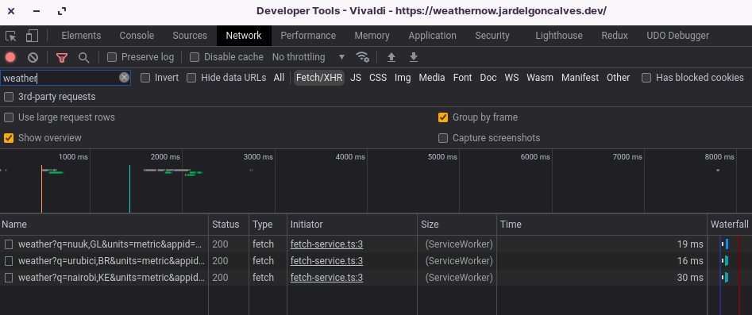

<div align="center">
  
  <p>Storing weather data for three cities using frontend caching with serviceWorker<p/>
</div>

## Tecnologias
- Typescript
- React.js
- React Query
- SASS
- Workbox / Service Worker
- RTL (React Testing Library)
- Storybook (doc de components)
- Eslint + Prettier
- Husky + Commitlint

## Configurando variáveis de ambientes
Altere o nome do arquivo `.env.sample` para `.env` e atribua o valor para a variável de ambiente:
```
REACT_APP_APPID=<openweathermap appId>
```
Caso conseguir um `appId` cadastre-se em [https://openweathermap.org](https://openweathermap.org) e crie uma API KEY.

## Instalando as dependências
```bash
yarn # preferência

# ou

npm i
```

## Rodando Projeto em modo desenvolvimento
**OBS**: Os serviceWorkers não funcionam em modo de desenvolvimento por necessitar de HTTPS, caso necessite verificar o cache do serviceWorker você pode optar por rodar em modo de produção.
```bash
yarn start

# ou
npm run start
```

## Rodando Projeto em modo produção
Gere o código de produção
```bash
yarn build

# ou
npm run build
```

Em seguida rode o projeto com o `serve`
```bash
npx serve -s build
```

Neste modo as requisições estão sendo cacheadas no Front-End com o ServiceWorker por 10 minutos como podemos ver na imagem abaixo:

<div aling="center">
  
</div>

## Rodando doc dos componentes
```bash
yarn storybook

# ou
npm run storybook
```

## Rodando os testes
```bash
yarn test

# ou
npm run test
```
